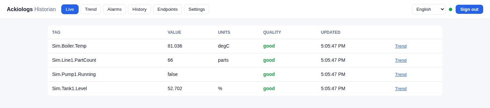
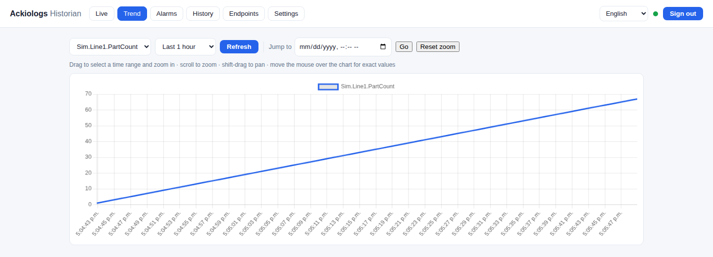
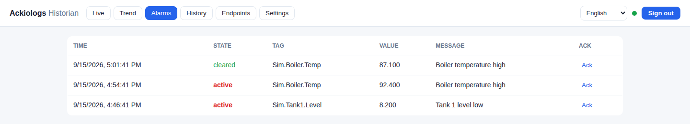
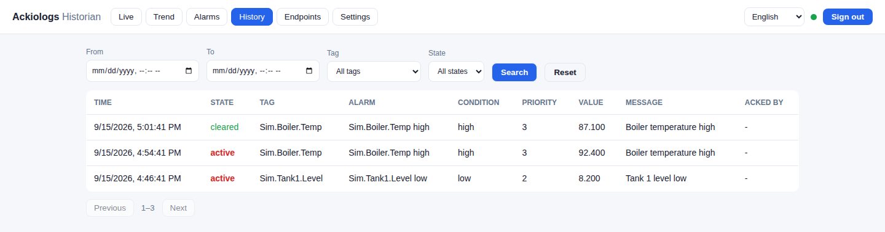
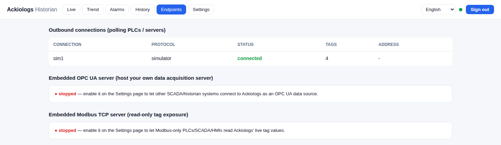
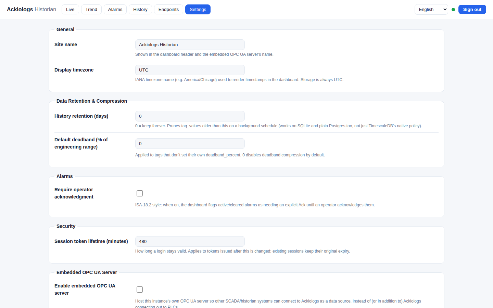

# Ackiologs

A protocol-agnostic industrial data historian. Collect time-series data from PLCs,
building automation, network/power gear, SCADA systems, IIoT gateways, and
anything with an HTTP API or database — over OPC UA, Modbus, MQTT, EtherNet/IP,
Siemens S7, BACnet/IP, SNMP, HTTP/REST, or SQL; store it in SQLite (zero-config)
or TimescaleDB (production scale); trend it (with a FactoryTalk/PI-style crosshair
cursor and drag-to-zoom), alarm on it, and expose it over a REST/WebSocket API and
a built-in dashboard.

## Screenshots

| Live values | Trend chart |
|---|---|
|  |  |

| Alarms | Alarm history |
|---|---|
|  |  |

| Endpoints | Settings |
|---|---|
|  |  |

## Features

- **Ten protocols out of the box** — OPC UA (subscriptions), Modbus TCP/RTU
  (polling), MQTT (plain or JSON-path/Sparkplug-style payloads), EtherNet/IP
  (Allen-Bradley/Rockwell CIP, via `pycomm3`), Siemens S7 (S7-300/400/1200/1500,
  via `python-snap7`), BACnet/IP (building automation, via `bacpypes3`), SNMP
  (network/UPS/environmental gear), generic HTTP/REST polling (any JSON API —
  the escape hatch for cloud SCADA and vendor APIs), generic SQL polling (any
  external historian/MES/ERP database), and a built-in Simulator for demos and
  tests. The connector interface (`app/connectors/base.py`) is small — adding
  DNP3, Profinet, or another vendor API is one new class; see
  [Adding a Protocol](#adding-a-protocol).
- **Pluggable storage** — SQLite by default (nothing to install), or Postgres +
  TimescaleDB for production (auto-creates the hypertable). History retention
  is a live Settings-page value, not a fixed policy: one background pruner
  enforces it the same way on every backend.
- **Deadband compression** — per-tag or global percent-of-range deadband so noisy
  signals don't flood storage.
- **Alarming** — high/high-high/low/low-low/digital/bad-quality conditions defined
  per tag in config, with a full alarm & event journal (activate/clear history).
- **Live dashboard** — real-time value table over an authenticated WebSocket,
  historical trend charts (raw or time-bucketed) with a FactoryTalk/PI-style
  crosshair cursor (exact time + value under the mouse), drag-to-zoom into a
  specific window and a "jump to hour" time picker to pinpoint an exact
  window, alarm log, and connection health — no build step, all JS assets
  vendored (nothing fetched from a CDN), so it works on an air-gapped OT
  network.
- **REST + WebSocket API** — tags, history (raw & aggregated), live streaming,
  connection health, alarm events, and tag writes (setpoints) — see `/docs` for
  interactive OpenAPI docs once running.
- **JWT auth with roles** (admin/operator/viewer); disable for isolated demo/dev use.
- **Host your own OPC UA or Modbus server** — the reverse of the OPC UA/Modbus
  client connectors: flip on "Embedded OPC UA Server" and/or "Embedded Modbus
  Server" in Settings and Ackiologs itself becomes a data acquisition server
  other SCADA/historian/MES systems, PLCs, or HMIs can connect *into*, instead
  of only ever polling field devices. The OPC UA server exposes every tag
  live under `Objects/Tags` (optional username/password auth); the Modbus TCP
  server exposes float/int tags as input registers and bool tags as discrete
  inputs — read-only by protocol design (Modbus has no write function code for
  either table) — with the exact tag-to-address map shown on the Endpoints
  page, since Modbus has no way to discover that over the wire.
- **Live-editable Settings page** — industry-standard, dashboard-editable
  settings (site identity, history retention, default deadband, alarm
  acknowledgment requirement, session lifetime, both embedded servers'
  ports/auth, display preferences) that take effect immediately, no restart —
  see `app/core/settings_registry.py` for the full, always-accurate list.
- **ISA-18.2 style alarm acknowledgment** — operators Ack an active/cleared
  alarm from the Alarms page; the ack is appended to the alarm & event journal
  rather than rewriting history.
- **Alarm History page** — a dedicated, searchable view of the full alarm &
  event journal, separate from the Alarms page's live feed: filter by time
  range, tag, state, or alarm priority, with pagination for digging through
  a large history (`GET /api/alarms/history`).
- **Endpoints page** — one place to see every outbound connection (protocol,
  status, tag count) alongside both embedded servers' live status, endpoint,
  and (for Modbus) full register map.
- **Multi-language dashboard** — English, Spanish, French, German, Portuguese,
  and Chinese, switchable from the login screen or the header at any time (no
  reload needed); an operator's choice is remembered in their browser, and
  admins can set the site-wide default under Settings → Display. See
  `app/web/static/i18n/` for the translation files and `app/web/static/i18n.js`
  for the loader — adding another language is one more JSON file.
- **Config-as-code** — `config/connections.yaml` and `config/tags.yaml` fully
  define what's collected; edit and `POST /api/config/reload`, or restart.
- **Deploys in one command** — Docker Compose, SQLite by default, TimescaleDB as
  a one-line overlay.

## Downloads

Every tagged release (`vX.Y.Z`) publishes four artifacts from the same commit —
see [Releases](https://github.com/Installation-04/ackiologs/releases):

| Platform | Artifact |
|----------|----------|
| Docker (any OS) | `ghcr.io/installation-04/ackiologs:X.Y.Z` (and `:latest`) |
| Linux (x86_64) | `ackiologs-linux-x86_64-vX.Y.Z.tar.gz` — standalone binary, no Python required |
| Windows (x86_64) | `ackiologs-windows-x86_64-vX.Y.Z.msi` — permanent install, runs as a background Windows Service |
| Windows (x86_64) | `ackiologs-windows-x86_64-vX.Y.Z.zip` — portable exe, no install needed |

The Linux tarball and Windows zip both bundle a `config/` folder with the same
example tags/connections as this repo — edit those files next to the binary,
or point `ACKIOLOGS_TAGS_CONFIG_PATH`/`ACKIOLOGS_CONNECTIONS_CONFIG_PATH` (and
`ACKIOLOGS_DATABASE_URL`) elsewhere.

The Windows **MSI** is the "install it once, it just runs" option: it
registers Ackiologs as a real Windows Service (`services.msc` / `sc query
Ackiologs`) that starts automatically at boot, keeps running in the
background with no console window and no one signed in, and restarts with
the OS after a reboot. Setup adds a "Ackiologs Dashboard" Start Menu shortcut
(opens `http://localhost:8000`) plus an "Ackiologs Historian (Manual)"
shortcut that runs the same console build as the portable zip, for
troubleshooting when the service is stopped. Program files go in
`%ProgramFiles%\Ackiologs`; config and data live in `%ProgramData%\Ackiologs`
(shared by the service and a manual run alike), writable without admin
rights, wired up automatically via machine-wide environment variables.

The Windows **zip** is the portable option: unzip it anywhere and run
`ackiologs.exe` yourself — it opens a console window and only runs while
that window (and your session) stays open, nothing is installed or
registered as a service. Use it for a quick trial, a USB-stick install, or
running a second instance on another port alongside the installed service.

`GET /api/version` reports the running build's version on any of the four.

### Guided Linux install (systemd or Docker)

`scripts/install.sh` asks how you want to run it and sets it up for you —
install method (systemd service or Docker Compose), database backend (SQLite
or TimescaleDB, managed or external), network bind address/port, and history
retention:

```bash
sudo ./scripts/install.sh
# or, standalone:
curl -fsSL https://raw.githubusercontent.com/Installation-04/ackiologs/main/scripts/install.sh | sudo bash
```

The systemd path installs the Linux binary to `/opt/ackiologs`, config to
`/etc/ackiologs`, data to `/var/lib/ackiologs`, and a hardened
`ackiologs.service` unit (runs as its own unprivileged `ackiologs` user).
For scripted/non-interactive use, export the answers as env vars
(`INSTALL_METHOD`, `DB_BACKEND`, `BIND_HOST`, `PORT`, `RETENTION_DAYS`, ...)
and pass `--yes`.

### Cutting a release

Releases are tied to the version in `pyproject.toml`, not to merges: bump
`version` there as part of a PR (following [semver](https://semver.org)) and
merge it to `main`. The [auto-tag workflow](.github/workflows/auto-tag.yml)
notices the version changed, tags that commit `vX.Y.Z`, and pushes the tag —
which is what triggers the [release workflow](.github/workflows/release.yml)
to build and publish all four artifacts (Linux binary, Windows exe/MSI, Docker
image) as a GitHub Release. A version that hasn't changed, or a merge that
doesn't touch `pyproject.toml` at all, cuts no release — so day-to-day PRs
don't spam a release each.

To cut one manually instead (skipping the version-bump convention), tag and
push directly:

```bash
git tag v1.2.3
git push origin v1.2.3
```

## Quickstart (Docker — recommended)

```bash
docker compose up -d
```

Open http://localhost:8000. The first boot creates a default `admin` user with a
random password — check the container logs for it:

```bash
docker compose logs historian | grep "Created default admin"
```

It ships with the Simulator connection enabled, so you'll see live trending data
immediately with no field equipment required.

### With TimescaleDB (production-scale storage)

```bash
docker compose -f docker-compose.yml -f docker-compose.timescale.yml up -d
```

This adds a TimescaleDB container and points the historian at it — `tag_values`
is automatically converted into a hypertable on startup.

## Quickstart (local, no Docker)

```bash
./scripts/quickstart.sh
```

Creates a venv, installs dependencies, and runs the app with SQLite at
http://localhost:8000.

## Configuring data collection

Edit `config/connections.yaml` (where to connect) and `config/tags.yaml` (what to
collect), then either restart or call:

```bash
curl -X POST http://localhost:8000/api/config/reload -H "Authorization: Bearer $TOKEN"
```

New connections need a restart; tag/alarm edits on existing connections apply on reload.

### Tag address formats

| Protocol   | `address` format                                            | Example                                            |
|------------|---------------------------------------------------------------|-----------------------------------------------------|
| OPC UA     | UA NodeId string                                               | `ns=2;s=Pump3.Pressure`                            |
| Modbus     | `<table>:<register>[:<encoding>]`                              | `holding:40001:float32`, `coil:5`                  |
| MQTT       | topic, or `json:<topic>:<dotted.key.path>`                     | `json:plant/line1/telemetry:temperature`           |
| EtherNet/IP| PLC symbolic tag name                                           | `Program:MainProgram.Line1.Speed`, `Recipe[3].Setpoint` |
| Siemens S7 | snap7 PLC-address string                                       | `DB1.DBD4:REAL`, `DB1.DBX0.0:BOOL`, `M10.0:BOOL`   |
| BACnet/IP  | `<device_address>:<object-type>:<instance>[:<property>]`       | `192.168.1.51:analog-input:3`                      |
| SNMP       | numeric OID                                                     | `1.3.6.1.2.1.33.1.2.4.0`                           |
| HTTP/REST  | path, or `json:<path>:<dotted.key.path>`                        | `json:/v1/sites/a/telemetry:readings.temperature`  |
| SQL        | a read-only query (first column of first row is the value)     | `SELECT oee FROM line_metrics ORDER BY ts DESC LIMIT 1` |
| Simulator  | unused; behavior set by the tag's `sim:` block                 | `sine`, `random_walk`, `counter`, `bool_toggle`    |

Modbus tables: `holding`, `input`, `coil`, `discrete_input`. Register encodings
(holding/input only): `int16` (default), `uint16`, `int32`, `uint32`, `float32`.
Full worked examples for every protocol are in `config/connections.yaml` and
`config/tags.yaml` (commented out except for the Simulator, which is enabled
by default).

## Adding a protocol

Subclass `app.connectors.base.BaseConnector`, implement `async def run(self)` to
connect and call `await self.emit(tag_name, value, quality=...)` for each sample,
and register the class in `app/connectors/registry.py`. Nothing else in the
system — storage, API, dashboard, alarms — needs to change.

## API

Interactive docs at `/docs` once running. Highlights:

- `POST /api/auth/token` — login, returns a JWT.
- `GET /api/tags` — all tags with current live value.
- `GET /api/history/{tag}?start=...&end=...&interval_seconds=...` — raw samples
  (`interval_seconds=0`) or time-bucketed avg/min/max/count.
- `WS /ws/live` — live value stream, all tags.
- `POST /api/tags/{tag}/write` — write a value back to the field device
  (operator/admin role; supported protocols only).
- `GET /api/connections` — connector health.
- `GET /api/alarms/events` — alarm/event journal.

## Architecture

```
connectors (OPC UA / Modbus / MQTT / Simulator / ...)
        │  Sample(tag, value, ts, quality)
        ▼
   asyncio.Queue
        │
        ▼
 ingest pipeline  ──► live bus (WebSocket, current-value cache)
        │           ──► alarm evaluation (alarm & event journal)
        ▼  (deadband-filtered, batched)
   SQLite / TimescaleDB
        ▲
        │
   REST / WebSocket API ──► dashboard (static HTML/JS)
```

## Configuration reference

All settings are environment variables prefixed `ACKIOLOGS_` (see `app/config.py`
and `.env.example`), including `DATABASE_URL`, `SECRET_KEY`, `AUTH_ENABLED`, and
`RETENTION_DAYS`.

## Development

```bash
pip install -e ".[dev]"
pytest
```
